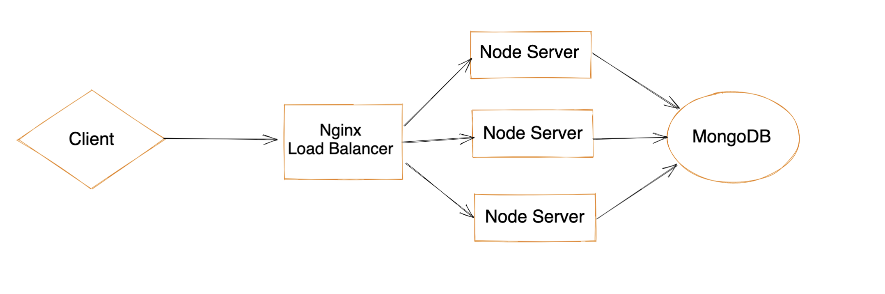

#Timers System

Dockerized application for creating timers service.

## Description

The system is built over a Nginx load balancer which calls Node.js express servers
in a round-robin manner.
In this way we can handle large scale of requests.
Data is stored over MongoDB container.

## System architecture

## Getting Started

* Please make sure you have Docker installed on your computer.
* check that you are using node v16 (use NVM)

### Installing

* git clone https://github.com/yairsep/timersSystem
* cd server
* npm install --legacy-peer-deps
* docker-compose up
* The service is up and running
* Open postman and import [collection](timers.postman_collection.json) from the repo.
* Enjoy!

### Endpoints

#### POST /timers
* Call "localhost:80/timers"
* Example Body: {"hours": 0,"minutes": 0,"seconds": 10,"url": "https://someserver.com"}
* If this a first call a post request to https://someserver.com/1 in 10 seconds
* Calling it again will trigger post request to https://someserver.com/2
* And so on

#### GET /timers/:id
* After creating new timers calling "localhost:80/timers/:id" will return time left
of timer to be executed

#### GET /getAll

* Get all data in mongoDB
* An internal endpoint for testing porpoises obviously won't be exposed on production mode
* 
#### DELETE /deleteAll

* Delete all data in mongoDB
* An internal endpoint for testing porpoises obviously won't be exposed on production mode

### Scaling

* Currently, the system is configured to run 3 instances of express server
* In order to create more instances run the system with:
* docker-compose up --scale app=NUM_OF_SERVERS

### Testing

* In order to run tests:
* cd server & npm run test

### Extras

* In real production level product I would use AWS / GCP auto-scaling tools & load balancing services